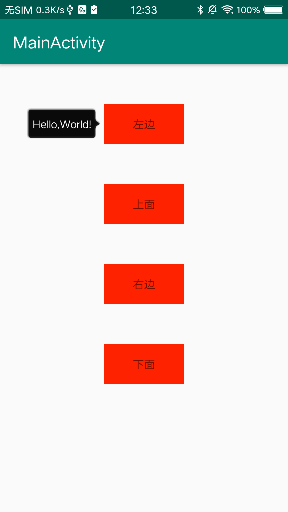

<!--
 * @Description: 
 * @Author: zhaodexi
 * @Date: 2019-08-18 12:09:39
 * @LastEditor: zhaodexi
 * @LastEditTime: 2019-08-18 12:47:21
 -->
# IdiotBubble
Android 气泡弹框组件

借助PopupWindow实现的一个通用提示气泡组件

## ScreenShot

## Version
### 1.0 
支持： 
 -指定位置方向
-指定针脚偏移量
-指定气泡颜色
-指定气泡圆角弧度
-指定气泡距离
-指定

## TODO

